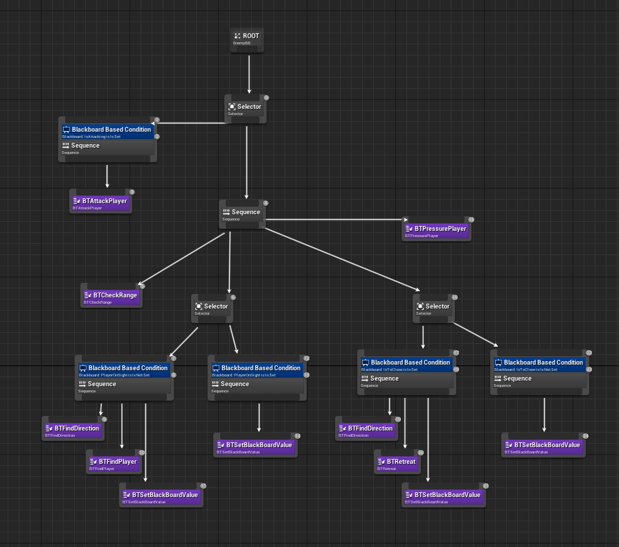
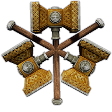

<h1 style="color:Cyan"> Gladiator Game </h1>

<h2 style="color:turquoise">Introduction </h2>

This project is a Gladiator game based on the instructions given and some bonus features. 
This game was made only using copyright free assets and credits will be in the end of this README file  
This game was made by Matias Heno and Bruno Gomes between the 24/10/2022 and the 21/11/2022  

<h2 style="color:cyan"> C++ </h2>

The main purpose of this project was to understand the c++ architecture for unreal engine 4.27 and we had to discover pretty much everything again.  
We decided to implement everything exept animation of VFX in c++ files and not using any blueprints for anything else.
The comprehension of how to use C++ for unreal and use the multiples modules were the main issues and it's what took us a lot of time in the beginning of the project.  

<h2 style="color:cyan"> Entities </h2>

The player was made in c++ and inherit from the entity class which itself inherit from the ACharacter class, and same for the enemies.
The player use a classic controller and we used the default input system and binding to create our keybinding.
The enemies and player inherit from the same class because they share a lot of features such as : the hammer and shield, the animation montage, the health manager and more.

<h2 style="color:cyan"> Animation </h2>

The animation was made following the animation classes we had and some web tutorial, we implemented an animation for every action the player or the enemies can do and some of them are home made even if we use mostly the animation given by the teacher.

<h2 style="color:cyan"> AI </h2>

The AI was made using the behavior tree and blackboard of unreal engine 4.27.  
All the tasks were made in C++ and no services were used because we understood to late how they work and we already had done the AI at that point. 
This is our behavior Tree, it's the same for every enemy and they also share the same AI_Controller (They all have their own instance but it's the same class).  

To manage all those AI we created an AIDirector which dictate to the AI who will attack and when, that's pretty all it does for now.

<h2 style="color:cyan"> UI </h2>

The UI was fully made in C++ and only the design of the widget was made in BP, we used 

> meta = (BindWidget) 

to force the implementation of some buttons or text inside the BP widget to prevent errors and to use the behavior we want on those widget.

<h2 style="color:cyan"> Hammer Throw </h2>

The hammer throw is a bonus feature we implemented and it was made using the projectile component of unreal.
To create a great visual for the throw we created a new BP that is multiple hammer and we we rotate it the design is great which wasn't the case with only one hammer. 

Design of the multiple hammer blueprint 

<h2 style="color:cyan"> Sounds & VFX </h2>

We added basic sound effects found in the internet for the game because we didn't liked the one given in the template.
There is sound for hit, miss, throw, walk and death.
To add some juiciness to the game we created some VFX for when an entity is hit with some blood particles, and lightning coming from the hammer when it's in the air. 

<h2 style="color:Yellow"> Bindings </h2>

The keybinding of the game are :
<ul>
<li> WASD to move 
<li> Space to launch the hammer
<li> Left Click to use the normal attack
<li> Right Click to use the shield
<li> Escape to open the pause menu
<li> Tab to lock and enemy
<li> Mouse Wheel to change the current locked enemy
</ul>

<h2 style="color:Yellow"> Credits </h2>

The image for the victory screen was found on : wallpapercave.com  
The sound of the game were found on : OpenGameArt.org  
The background song : Victor Cooper - Windwalker  
The assets of the level and the characters are from our template.  
The game was made by Matias Heno and Bruno Gomes  

<h2 style="color:red"> Shortcomes </h2>

The straffing animation of the enemies is not perfect and could be upgraded.  
We could properly reset the level when starting a new round because it's not perfect for now  

